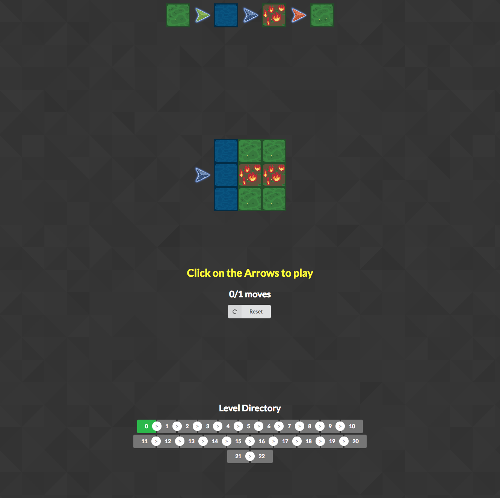
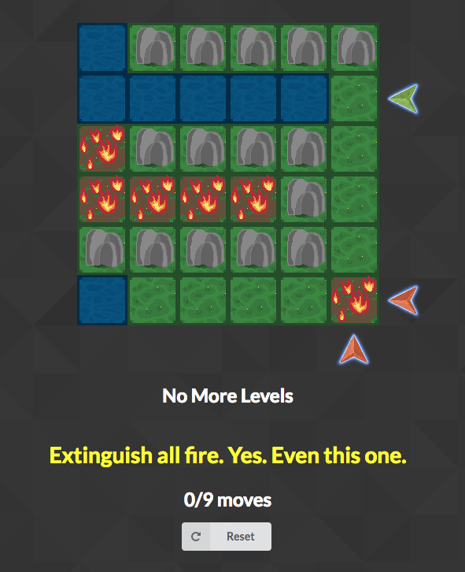

# under_the_dirt

## Installation

Clone this repository and install the other dependencies with npm:

```
git clone https://github.com/mtrazzi/under_the_dirt.git
cd under_the_dirt
npm install
npm install webpack webpack-cli
```

## Running the game

Launch the following commands in two separate terminals:
```
npm run webpack
npm start
```

## Play

Now, just go into your favorite browser (e.g. Chrome) and copy-paste the following url:

``http://localhost:8080``

You should be seeing the following screenshots.

## Screenshots [SPOILER ALERT]

### Home page


### Easy Level



### Hard Level
<p align="center">

</p>
